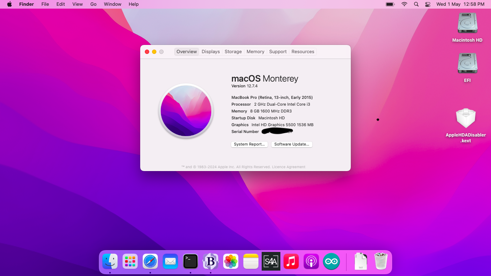

# EFI-for-dell-inspiron-15-3558
EFI for dell Inspiron 15 3558 for hackintosh monterey.  
The above EFI folder also includes kexts for wifi, bluetooth,etc.

Specs for Dell inspiron 15 3558 are :-
1. CPU: corei3 5005u
2. RAM: 8GB DDR3L
3. HDD: 500GB
4. GPU: Intel HD Graphics 5500
5. Wifi/Bluetooth: Intel AC3160
6. Sound: Intel Broadwell HDMI Audio (Requires VooDooHDA kext not included in the EFI)

Not working :-
1. Ethernet
2. SD Card
3. Sound
4. Bluetooth (Partially working and may need to re-apply kexts to get it working)

